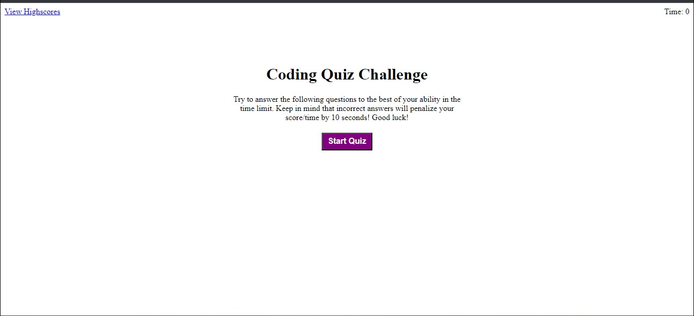

# Code-Quiz-HW

This application provides users with the oppurtunity to test their coding knowledge with basic multiple choice option questions. Code quiz calculates and stores the users scores once completed. It is stored in the 'View Highscore' link. This application includes HTML, CSS, Javascript, and web APIs technologies. 

